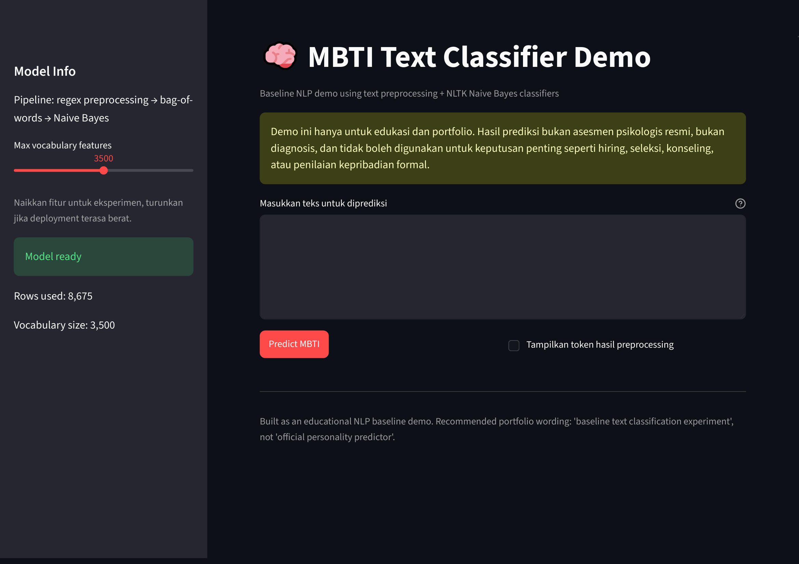
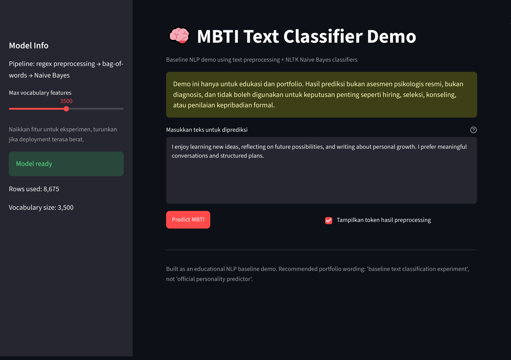
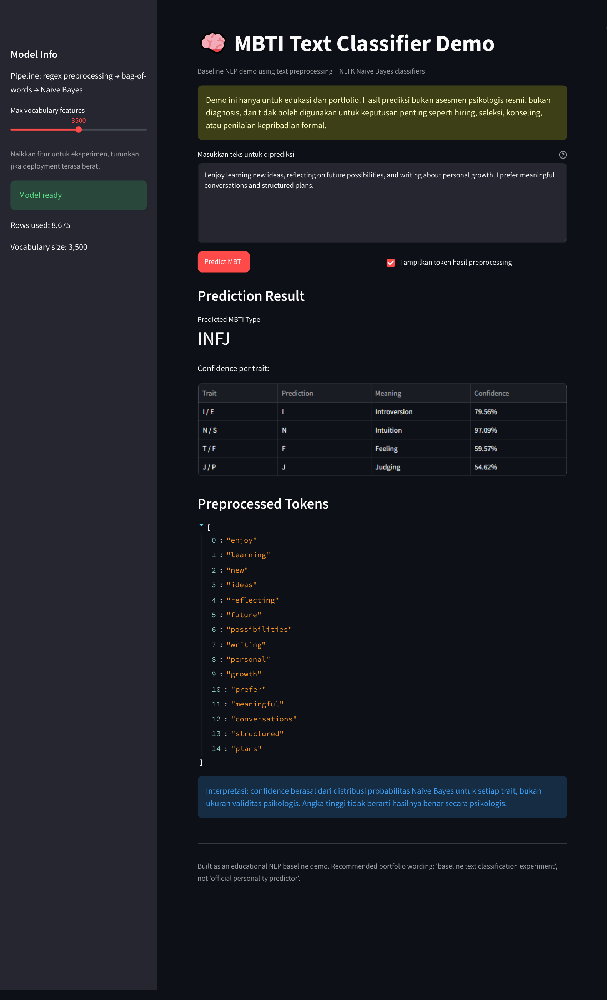

# MBTI Classifier — NLP Text Classification

## Overview

MBTI Classifier is an educational Natural Language Processing (NLP) project that predicts MBTI-style personality traits from user-provided text. The project uses text preprocessing, bag-of-words style features, and Naive Bayes classifiers.

This project is designed as a machine learning portfolio demo. It should **not** be treated as an official psychological assessment.

---

## Live App

Try the Streamlit demo here:

https://mbti-classifier-nlp-elkew8jedtccsxd9exyxoh.streamlit.app/

> Disclaimer: This demo is for educational and portfolio purposes only. It is not an official psychological test, diagnosis tool, or personality assessment.

---

## Preview







---

## Project Goals

The goals of this project are to demonstrate:

- basic NLP text preprocessing,
- text classification workflow,
- bag-of-words feature extraction,
- Naive Bayes baseline classification,
- simple model evaluation,
- Streamlit demo deployment,
- responsible communication of machine learning limitations.

---

## Features

- User text input
- Text preprocessing
- MBTI-style trait prediction
- Naive Bayes classification
- Trait-level confidence display if available
- Streamlit web interface
- Educational disclaimer

---

## Tech Stack

- Python
- pandas
- NumPy
- NLTK
- Naive Bayes Classifier
- Streamlit
- Jupyter Notebook

---

## Project Structure

```text
mbti-classifier-nlp/
├── app.py
├── requirements.txt
├── README.md
├── mbti_classifier_notebook.ipynb
├── data/
│   └── dataset.zip
└── screenshots/
    ├── 01-streamlit-home.png
    ├── 02-text-input.png
    └── 03-prediction-result.png
```

---

## Dataset

The dataset is stored in:

```text
data/dataset.zip
```

The CSV inside the ZIP should contain at least these columns:

```text
type
posts
```

Column description:

| Column | Description |
|---|---|
| `type` | MBTI label such as INFP, INFJ, INTP, ENFP, etc. |
| `posts` | Text posts used as input data for NLP classification |

For privacy and safety reasons, the public demo should not expose raw personal text samples.

---

## How It Works

### 1. Text Preprocessing

The text is cleaned using steps such as:

- converting text to lowercase,
- removing URLs,
- removing punctuation and non-alphabetic characters,
- removing stopwords,
- extracting useful word tokens.

### 2. Feature Extraction

The cleaned text is converted into simple word-based features using a bag-of-words style representation.

### 3. Model

The project uses Naive Bayes classifiers as baseline models.

The demo predicts MBTI-style traits through four binary classifiers:

- Introvert vs Extrovert
- Intuition vs Sensing
- Thinking vs Feeling
- Judging vs Perceiving

The predicted letters are combined into one MBTI-style output.

Example output:

```text
INFJ
INTP
ENFP
```

---

## Local Setup

### 1. Clone Repository

```bash
git clone https://github.com/frnqpur/mbti-classifier-nlp.git
cd mbti-classifier-nlp
```

### 2. Create Virtual Environment

Windows:

```bash
python -m venv .venv
.venv\Scripts\activate
```

Mac/Linux:

```bash
python3 -m venv .venv
source .venv/bin/activate
```

### 3. Install Dependencies

```bash
pip install -r requirements.txt
```

### 4. Prepare Dataset

Make sure the dataset exists at:

```text
data/dataset.zip
```

### 5. Run Streamlit App

```bash
streamlit run app.py
```

Then open:

```text
http://localhost:8501
```

---

## Deployment

This project is deployed using Streamlit Community Cloud.

Recommended deployment settings:

```text
Repository: frnqpur/mbti-classifier-nlp
Branch: main
Main file path: app.py
```

cPanel is not recommended for this project because many shared hosting plans do not support Python machine learning dependencies such as pandas and NLTK.

---

## Usage

Enter an anonymous sample text, for example:

```text
I enjoy learning new ideas, reflecting on future possibilities, and writing about personal growth. I prefer meaningful conversations and structured plans.
```

The app will display:

- predicted MBTI-style type,
- trait-level predictions,
- confidence values if available,
- educational disclaimer.

---

## Important Disclaimer

This project is for educational and portfolio purposes only.

The prediction result is **not**:

- an official psychological test,
- a diagnosis,
- a counseling tool,
- a hiring assessment,
- a formal personality evaluation.

The model output should not be used for medical, psychological, hiring, counseling, or other sensitive decisions.

---

## Limitations

This project has several limitations:

- The model is a baseline model.
- Feature extraction is simple.
- Dataset may contain bias.
- Prediction depends on input text quality and length.
- Confidence values do not represent psychological validity.
- The system is not production-ready.
- The result should not be interpreted as an official MBTI assessment.

---

## Future Improvements

Possible improvements include:

- using TF-IDF feature extraction,
- trying Logistic Regression or Linear SVM,
- adding cross-validation,
- adding classification reports,
- saving trained models using pickle or joblib,
- improving Streamlit UI,
- adding anonymous sample inputs,
- creating a model card,
- improving dataset privacy handling.

---

## Summary

Built an educational NLP text classification demo using Python, text preprocessing, bag-of-words features, and Naive Bayes classifiers to predict MBTI-style traits from user input. The project includes a Streamlit demo and clear limitations to avoid presenting the output as an official psychological result.

---

## License

Use an appropriate license based on the dataset source and project ownership.
